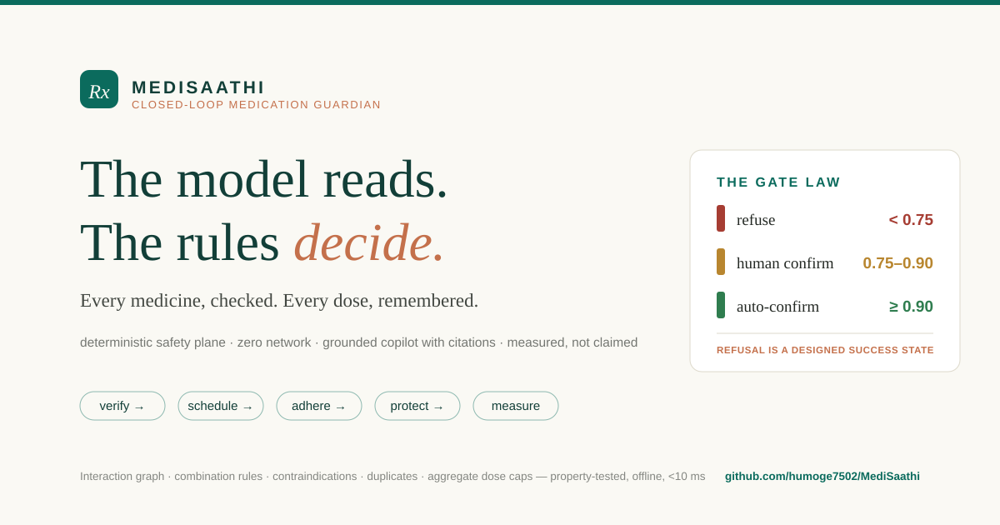

# MediSaathi · वैद्य — Agentic Medication Guardian

<p align="center">
  
</p>

**Every medicine, checked. Every dose, remembered.**

MediSaathi is a closed-loop medication-safety platform built for **VMEDITHON
V3.0** (VIT Chennai, Bio × Engineering track). It closes the loop that
reminder apps and pharmacy apps leave open:

> **verify → schedule → adhere → protect → explain → measure**

A deterministic safety engine — not the AI — decides what is safe. The AI only
reads. **When the system isn't sure, it refuses. On purpose.** That refusal is
the product working, not failing.

## Why

- Long-term therapy adherence in India sits at **16.6–24.1%**; a 2023
  meta-analysis of 2,840 patients with NCDs measured an average adherence of
  **~51%** (source recorded in `research/adherence.json`).
- Medication errors cost the world **~$42B/year** (WHO, *Medication Without
  Harm*; `research/who.json`).
- **62% of antibiotics in India are supplied without a prescription**; only
  **6–10% of adverse drug reactions** are ever reported.
- Reminder apps ping. Pharmacy apps sell. **Nothing verifies.**

## The architecture law

```
                 ┌────────────────────────────────────────────┐
Rx text / photo →│ PERCEPTION · model proposes lines + per-  │
                 │ line confidence (temperature 0, strict     │
                 │ JSON; deterministic splitter as fallback)  │
                 └──────────────────┬─────────────────────────┘
                                    ▼
                 ┌────────────────────────────────────────────┐
                 │ GATE LAW · refuse < 0.75 · human-confirm   │
                 │ 0.75–0.90 · auto-confirm ≥ 0.90            │
                 └──────────────────┬─────────────────────────┘
                                    ▼
                 ┌────────────────────────────────────────────┐
                 │ SAFETY PLANE · deterministic · zero network│
                 │ normalize → pairwise interactions →        │
                 │ combination graph (triple whammy, QT,      │
                 │ serotonin, bleeding stacks) → contra-      │
                 │ indications → duplicates → aggregate dose  │
                 │ caps → verdict (first match wins)          │
                 └──────────────────┬─────────────────────────┘
                                    ▼
              PLAN → dose schedule → adherence analytics (MPR,
              streaks, 14-day heatmap) → family escalation feed
              → grounded copilot (3 gates + citations)
              → evidence tab (live self-test + eval)
```

**The model reads. The rules decide.** If every LLM on earth vanished, the
safety plane, scheduling, adherence analytics and family circle keep working.
That is the difference between an AI wrapper and an engineered system.

## What the product does (the closed loop)

1. **Verify** — paste a prescription. An LLM reads it (per-line confidence),
   but a **deterministic safety engine decides**: interactions, combination
   rules (triple whammy, QT stacks, serotonin stacks), contraindications
   against declared context, duplicate-molecule detection, aggregate dose
   caps. Below the confidence gate it **refuses — by design**.
2. **Schedule** — a verified plan becomes a dose timeline with a missed-dose
   guardrail that refuses to let anyone double up.
3. **Adhere** — check-ins build adherence %, MPR, streaks and a 14-day
   heatmap — the metrics the adherence literature uses.
4. **Protect** — a family circle receives timestamped escalations for late
   doses, skipped doses, and plans that started with safety findings.
5. **Explain** — a grounded copilot answers from a curated, source-attributed
   knowledge base (MedlinePlus/NIH, NHS, WHO) with three deterministic gates:
   emergency triage → scope refusal → grounded generation with citations.
   Low retrieval ⇒ refusal, not improvisation.
6. **Measure** — the in-app Evidence tab runs an 18-case engine self-test
   (no LLM, no network) and a 10-case copilot evaluation with an automated
   rubric judge. What is measured is shown; nothing is claimed.

## Repository — two tiers, one law

| Tier | Path | Role | Stack |
|---|---|---|---|
| **Product app** | `apps/web` | The demo product above — self-contained, offline-capable | Next.js 16 fullstack, TypeScript safety plane, Prisma + SQLite, bun |
| **Verification service** | `apps/api` | Deep verification: vision-LLM perception, spoken plans in en/ta/hi, Jan Aushadhi pricing, sealed-fixture judge cache | FastAPI, Pydantic contracts, SQLite WAL |

The safety plane exists in both languages (Python + TypeScript ports), each
with its own independent test suite — the law is the same, the evidence is
double.

## What is measured (not claimed)

| Benchmark | Result | Nature |
|---|---|---|
| Web engine self-test suite | **18/18 verdicts correct (100%)**, suite ~5–7 ms | Deterministic, reproducible, runs live in the Evidence tab |
| Web copilot refusal gates | emergency + scope refusals fire in ~0 ms, before any generation | Deterministic (pure regex + retrieval floor) |
| Web live degraded-tier verify | warfarin+aspirin → interaction; triple whammy → combination rule; child+doxy → contraindication; garbage → confirm queue — all **without any model** | Measured via HTTP smoke (see docs/TESTING.md) |
| Web E2E (Playwright) | **12/12 browser journeys** on the deterministic tier: landing → verify (interaction/combination/queue/injection-inert) → copilot gates → evidence → today + dose guardrail | `make web-e2e` |
| API suite | **112 tests passing** (safety properties, golden paths, perception, red-team, parity gate, body-cap) | `make test` |
| API fixture benchmark | brand recall 1.00 · frequency recall 0.94 · verdict agreement 1.00 · refusal precision 1.00 (n=12) | `make eval` |
| API latency | p50 11.3–12.4 ms, p95 13.4–15.4 ms (in-process ASGI, 100-request bench) | `python3 tools/bench.py` |
| Web route integration tests | **41 passing** — verify → plan → dose guardrail → family, plus middleware security contracts and the copilot gates, over an isolated SQLite, perception layer sealed (no model keys needed) | `cd apps/web && bun run test` |
| Cross-engine parity (ADR-0012) | **25/25 golden cases agree** between the TypeScript and Python safety planes | `make parity` |
| A1/A4 ablation | verdict agreement **1.00 → 0.17** without the gate/formulary | `make ablation` — the safety plane, not the reading, is the product |
| Copilot eval (10 labeled cases) | 100% type accuracy, groundedness 1.00, safety 1.00 (single run, automated rubric judge) | Engineering telemetry, **not** clinical validation |

Honesty rules embedded in the product: dataset provenance (DDInter / Stockley /
FDA / CredibleMeds / BMJ / WHO / NHS / MedlinePlus) is displayed wherever data
is used; refusal is a designed success state; the eval panel states it is not
clinical validation; every screen says "information layer — not a doctor".

## Quickstart

```bash
# Web tier (the product) — requires bun
cd apps/web
bun install
bun run db:push        # create SQLite schema (demo DB optional: Reset demo data seeds Asha's plan)
bun run dev            # http://localhost:3000

# API tier (verification service) — requires python3
make setup
make run               # http://localhost:8000/docs
```

The landing page is the pitch; **Launch app** opens the workspace. First run:
click **Reset demo data** to create Asha's demo plan with 14 days of dose
history (deterministic seed, ~79% adherence).

Demo the pipeline in 60 seconds:

```bash
# Product app (works fully offline — deterministic tier):
curl -X POST localhost:3000/api/verify -H 'Content-Type: application/json' \
  -d '{"text":"Warf 5 mg OD 30 days\nEcosprin 75 mg OD 30 days","contexts":[]}'
# → verdict: "interaction" — severe DDInter bleeding finding

curl -X POST localhost:3000/api/verify -H 'Content-Type: application/json' \
  -d '{"text":"Losar 50 mg OD 30 days\nLasix 40 mg OD 30 days\nBrufen 400 mg TDS 5 days","contexts":[]}'
# → triple whammy combination (ARB + diuretic + NSAID → AKI risk)

curl localhost:3000/api/evidence
# → 18-case engine self-test, 100% pass, dataset provenance

# API tier:
curl -X POST "localhost:8000/api/v1/prescriptions?sample_id=RX-002"
# → meta.verdict = "interaction" (warfarin + aspirin, severe, DDInter)
```

## The demo's resilience tiers

1. **Full tier** — LLM perception + grounded copilot + rubric judge (needs the model service).
2. **Degraded tier** — model unavailable: `/api/verify` falls back to a
   deterministic line-splitter and the safety plane runs at full strength
   using its own formulary-grounded confidence (verified: the warfarin,
   triple-whammy, contraindication and refusal verdicts all appear without
   any AI); the copilot honestly reports the language service is down and
   refuses to improvise.
3. **Offline tier** — engine self-test, scheduling, analytics, catch-up
   guardrails and family feed never touch the network.

The demo cannot be killed by WiFi, quota or a model outage — it *degrades
honestly, visibly, and safely*.

## Security posture

- **Deterministic safety gates** — dose-change, stop/start and emergency
  classes refuse before any generation; the double-dose guardrail is a
  first-action-wins law with audit; catch-up guidance is conservative and
  never advises doubling.
- **Prompt-injection containment** — perception output is inert text; the LLM
  only proposes lines, rules decide; invented brands land in the confirm
  queue (tested in both tiers).
- **Input validation** — length caps and JSON validation on every route;
  findings are rendered as text, never executed.
- **Server-side AI only** — the model SDK is imported exclusively in server
  code; no keys reach the browser.
- **Audit trail** — every verify, plan start, dose action, copilot query and
  eval run writes structured `AuditLog` metadata.
- **API tier** — request-ID correlation with injection-proof validation,
  security headers, sliding-window rate limiting (proxy-aware: a client-supplied
  `X-Forwarded-For` is trusted only behind an explicit `MEDISAATHI_TRUST_PROXY=1`),
  a 1 MiB JSON body cap (413 before the app reads a byte), upload MIME allow-list
  **plus** magic-byte sniffing, and fixture IDs hardened against path traversal
  (red-team suite: 46 tests).
- **Web tier** — the same contract in Next.js middleware: request-ID
  correlation + per-client sliding-window limits + bounded-memory eviction on
  `/api/*`; CSP, frame-deny and permissions-policy headers on every route;
  caregiver join codes from a CSPRNG (`crypto.getRandomValues`), never `Math.random()`.
- **Privacy by design** — no PII; single demo identity; data stays local
  (SQLite); no third-party transmission beyond the optional model prompt.

Full model: [docs/security/SECURITY_AUDIT.md](docs/security/SECURITY_AUDIT.md) and
[docs/ARCHITECTURE.md](docs/ARCHITECTURE.md).

## Tests

```bash
make test          # API suite: 112 tests (safety, golden paths, perception, red-team, parity, body-cap)
make eval          # API benchmark table
make ablation      # A1-vs-A4 counterfactual
make demo-check    # full offline API demo gate
make parity        # cross-engine parity gate: both planes agree 25/25
make web-check     # web gate: lint + typecheck + selftest + parity + integration tests + build
make web-e2e       # browser E2E: build + standalone server + 12 Playwright journeys
cd apps/web && bun run selftest   # the deterministic suite, in seconds
cd apps/web && bun run test       # route-handler integration tests (isolated SQLite)
```

CI (`.github/workflows/ci.yml`) runs all three tiers on every push/PR — API,
web and web-E2E — plus secret scanning (gitleaks), Python lint (ruff),
dependency audit (pip-audit), and a PR-only dependency review. Jobs run
least-privilege (`contents: read`).

## Engineering decisions (the interview section)

- **Why two planes?** An LLM that both reads and decides cannot be audited.
  Splitting them gives a property-tested, zero-network decision core and makes
  the model swappable without touching safety.
- **Why a deterministic safety plane in TypeScript *and* Python?** The product
  app is one-language, judge-demoable from one URL; the API tier carries the
  deep-verification features (vision, multilingual NLG, pricing). Two
  independent implementations of the same law, each with its own test suite —
  and the A1/A4 ablation proves the plane (not the reading) is what carries
  safety.
- **Why SQLite/Prisma?** The event build runs anywhere and survives demo-laptop
  restarts; the schema is Postgres-portable, and the store APIs are the
  documented swap points.
- **Why a zero-dependency BM25 retrieval?** Retrieval must be auditable and
  offline-safe in a safety-adjacent product; 30 curated chunks don't need
  embeddings. A vector index is a post-event upgrade, not a dependency.
- **Why refusal is a first-class result?** In medication, a confident wrong
  answer is worse than an honest one. Refusals are counted, displayed and
  designed — never hidden.
- **Why contracts/envelope discipline?** Typed end-to-end; the frontend cannot
  silently drift from the backend.
- **Why is the web dependency tree tiny?** The scaffold shipped ~40 Radix/UI
  packages and an editor/carousel/DnD stack; a grep-driven prune kept only what
  is imported (Prisma, Next, the toast/button primitives, the model SDK) —
  827 → 170 packages. Unused dependencies are attack surface and install-time
  friction dressed up as features.
- **Why CSS animations instead of framer-motion?** The motion budget is a few
  fade/stagger entrances and hover transitions; CSS handles that with zero
  runtime cost, and `prefers-reduced-motion` is honored in the same file that
  defines the animation. A JS animation library would earn nothing here.
- **What I would scale next?** Postgres, Redis limiter, OTP + ABDM-style
  consent, a labeled 300-case corpus with versioned DDInter/RxNorm snapshots,
  and a pharmacist review console over the (already persisted) confirm queue.

## Documentation map

| Doc | What's inside |
|---|---|
| [docs/BLUEPRINT.md](docs/BLUEPRINT.md) | evidence → concepts → architecture → execution record for the closed-loop build |
| [docs/ARCHITECTURE.md](docs/ARCHITECTURE.md) | both tiers, the two-plane law, data flows, ADR table, FMEA |
| [docs/DEMO_SCRIPT.md](docs/DEMO_SCRIPT.md) | 4-minute judge walkthrough + contingency drills |
| [docs/RESEARCH.md](docs/RESEARCH.md) | problem, hypothesis, method, measured results, limitations |
| [docs/TESTING.md](docs/TESTING.md) | test pyramid, red-team table, web regressions fixed with evidence |
| [docs/PERFORMANCE.md](docs/PERFORMANCE.md) | measured latency + bundle numbers, budgets |
| [docs/security/SECURITY_AUDIT.md](docs/security/SECURITY_AUDIT.md) | threat model, controls, honest gaps |
| [docs/TECH_DEBT.md](docs/TECH_DEBT.md) | open debt ledger + resolved-with-tests record |
| [docs/HACKATHON_STRATEGY.md](docs/HACKATHON_STRATEGY.md) | judged scorecard, demo path, judge-attack Q&A |
| [docs/DEPLOYMENT.md](docs/DEPLOYMENT.md) | both tiers, env vars, secrets, DB/migrations, monitoring, rollback |
| [docs/audit/REPOSITORY_AUDIT.md](docs/audit/REPOSITORY_AUDIT.md) | full repository audit (pre-integration state + addendum) |
| [docs/product/PRODUCT_STRATEGY.md](docs/product/PRODUCT_STRATEGY.md) | personas, JTBD, differentiation, roadmap |
| [docs/research/COMPETITIVE_ANALYSIS.md](docs/research/COMPETITIVE_ANALYSIS.md) | feature matrix vs Medisafe/Tata 1mg/etc. |
| [research/](research/) | literature review + references, novelty analysis, experiment protocol |

## Repository layout

```
apps/api            FastAPI verification service (pipeline, verdicts, plan, price, ADR, judge, upload)
apps/web            Next.js 16 fullstack product app (verify·today·insights·copilot·family·evidence)
  └ src/lib/safety  deterministic TS safety plane (dataset, engine, adherence, selftest)
  └ src/lib/ai      gated AI layer (extraction, retrieval, copilot, evals)
  └ prisma/         longitudinal schema (9 models, provenance-preserving)
packages/contracts  Pydantic v2 contracts — the API tier's single source of truth
data/               API seed CSVs, fixture corpus, cases manifest, eval labels, sources
eval/               API benchmark CLI (A1/A4 ablation, recall/agreement/precision/latency)
tools/              demo-check gate, judge-cache baker, latency bench
e2e/                web E2E suite (apps/web/e2e) — Playwright, deterministic tier only
docs/               architecture, blueprint, testing, security, strategy, audit, research
research/           literature review, references, novelty analysis, experiment protocol, recorded sources
```

## Honest limits (read before judging us)

- **Scope** — perception reads pasted/typed text; the API tier's photo path is
  live and key-gated (the demo default is the deterministic corpus so the
  walkthrough cannot fail on quota or WiFi).
- **Data** — curated demo corpus with recorded per-rule sources; production
  swaps in versioned DDInter/RxNorm/DailyMed snapshots. No statistics are
  fabricated in-product.
- **Auth** — event build is single-patient demo scope; caregiver links are
  code-based views, not authenticated accounts.
- **Not a doctor** — information layer only; not a medical device; not
  clinical validation. In an emergency, contact local emergency services.

## License

Code: MIT. Curated datasets: CC-BY 4.0 with recorded sources
(`apps/web/src/lib/safety/dataset.ts` header, `data/sources.json`).