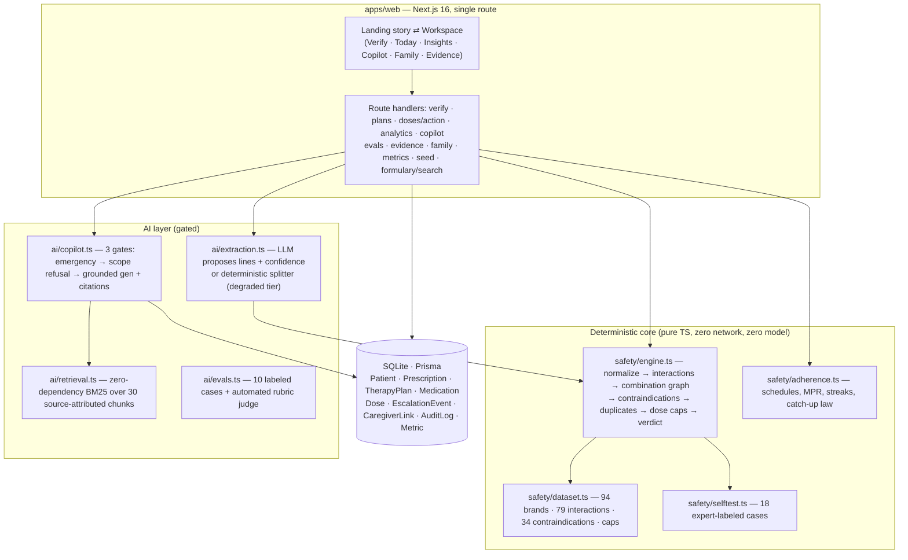
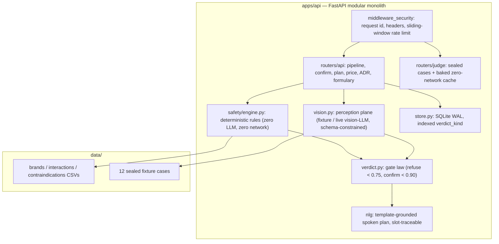

# MediSaathi — Architecture

Medication safety, closed-loop. One architecture law governs every module in
both tiers: **the model reads; the rules decide.**

The repository runs **two tiers**, deliberately:

| Tier | Where | Role | Runtime |
|---|---|---|---|
| **Product app** | `apps/web` | The demo/hackathon product: verify → schedule → adhere → protect → explain → measure. Self-contained (route handlers + SQLite/Prisma + deterministic TypeScript safety plane). | Next.js 16 fullstack, bun |
| **Verification service** | `apps/api` | The original deep-verification tier: vision-LLM perception, multilingual spoken plans, Jan Aushadhi pricing, sealed-fixture judge cache, red-team-tested security middleware. | FastAPI (Python) |

Both tiers implement the same law with independently tested engines (Python
and TypeScript ports of the safety plane). The product app is the primary
judge-facing build; the API service is its deep-verification companion.

## System overview — product app (`apps/web`)



**The model reads. The rules decide.** If every LLM vanished, the safety plane,
scheduling, adherence analytics and family feed keep working — the demo
degrades honestly (deterministic line-splitter, honest refusals), never
falsely.

## System overview — verification service (`apps/api`)



## The two-plane law (both tiers)

| Plane | Contains | May call | Must never do |
|---|---|---|---|
| **Perception** | vision LLM (live tier) / LLM line extraction / deterministic splitter | one model endpoint, schema-constrained, temperature 0, one retry | decide anything safety-related; invent a verdict |
| **Safety** | normalization, interaction graph, combination rules, contraindications, duplicates, dose caps, gate law | nothing — pure functions over in-memory snapshots | call a model; touch the network |

The confidence number is the **only** thing that crosses between planes. Below
the gate it refuses — refusal is a designed success state with a live counter.

## Product app data flow (one verify run)

```
POST /api/verify {text, contexts}
  → length caps (3..4000 chars), contexts array capped
  → perception: LLM lines+confidence  OR  deterministic splitter (fallback)
  → safety plane (deterministic):
      confidence gate → normalize → pairwise interactions → combination
      graph (triple whammy / QT stack / serotonin / bleeding) →
      contraindications vs declared contexts → duplicate molecules →
      aggregate daily caps → verdict (first match wins)
  → persist Prescription with full provenance (contextsJson preserved)
  → metrics + audit
```

`POST /api/plans` re-runs the plane with the **stored** contexts (never an
empty context — that regression is fixed and covered), schedules dose slots,
and raises a family escalation when the plan started with findings.
`POST /api/doses/action` is a **first-action-wins** law: a dose already
logged taken/skipped is never re-mutated (the double-dose guardrail), and the
catch-up guardrail persists a protected skip instead of claiming it.

## Copilot three-gate architecture

1. **Emergency triage** — deterministic pattern set → urgent-care redirect, no model call.
2. **Scope refusal** — personal dose-change/stop-start requests refused before generation (a rule, not a hope).
3. **Grounded generation** — the model answers ONLY from retrieved chunks with numbered citations; low retrieval ⇒ refusal, not improvisation; a post-check strips dosage prescriptions the model may have added; model unavailability ⇒ honest "language service down" refusal.

Gates 1 and 2 are extracted as `copilotGate()` — the same code path the
self-test suite exercises (see docs/TESTING.md).

## Persistence

- **Product app**: SQLite via Prisma. Longitudinal model: Patient, Prescription
  (provenance-preserving, including the declared contexts), TherapyPlan,
  Medication, Dose (indexed on scheduledAt), EscalationEvent, CaregiverLink,
  AuditLog, Metric. Single-file swap to Postgres post-event (no SQLite-only
  types).
- **API service**: single-file SQLite WAL; `verdict_kind` materialized and
  indexed; the store API (`create/get/put/count/verdict_counts`) is the
  documented Postgres swap point.

## Security architecture

- **Product app**: CSP (`script-src 'self' 'unsafe-inline'`, documented debt —
  nonce regime is the follow-up), frame-deny, nosniff, referrer + permissions
  policy, `object-src 'none'`; every route validates JSON and caps input
  lengths; findings are rendered as inert text, never executed; the model SDK
  is imported only in server code (no keys reach the browser); audit log on
  every verify / plan / dose / copilot / eval action; first-action-wins dose
  accounting prevents double-logging; no PII collected (single demo identity).
- **API service**: request-ID correlation with injection-proof validation,
  security headers, per-client sliding-window rate limiting, upload MIME
  allow-list **plus** magic-byte sniffing, prompt-injection containment
  (perception output is inert text) — all covered by the red-team suite
  (`tests/test_redteam.py`).
- **No auth in the event build** (read-only demo scope, documented). OTP +
  ABDM-style consent artifacts are the first post-event item.

## Engineering decisions (ADR index — full rationale in docs/DECISIONS.md)

| ADR | Decision | Alternatives rejected | Trade-off accepted |
|---|---|---|---|
| 001 | Contracts-first (Pydantic v2 package, mirrored TS client) | OpenAPI codegen | manual mirror risk, mitigated by envelope discipline |
| 002 | Modular monolith, 2 planes | microservices at demo scale | single process; store API isolates the future split |
| 003 | SQLite WAL + indexed verdict column | Postgres at event time, in-memory dict | one-writer ceiling; swap point documented |
| 004 | Fixtures carry the API demo; live vision key-gated | live-only demo | extraction runs on sealed corpus in the walkthrough |
| 005 | Template-grounded NLG, slot-traceable | free LLM generation of spoken doses | narrower phrasing; every word auditable |
| 006 | In-memory sliding-window limiter | Redis | per-process only; interface is the swap point |
| 007 | Refusal = HTTP 200 with refused verdict | 4xx | clients must read the verdict field |
| 008 | **Product app = self-contained Next.js fullstack** (integrated from `vaidya-project.zip`) | keeping the two-service split as the only product; running two overlapping web UIs | two safety-plane implementations (TS + Python) must not drift — mitigated by independent test suites and the shared dataset discipline; the API tier stays the deep-verification companion |

## Failure modes (FMEA extract)

| Failure | Detection | Behavior | Mitigation |
|---|---|---|---|
| LLM/network down at demo | try/catch in extraction/copilot | deterministic splitter + honest refusals; safety plane unchanged | three-tier degradation (full → degraded → offline), rehearsed in docs/DEMO_SCRIPT.md |
| WiFi dead at judge | — | product app fully offline-capable; API judge cache pre-baked | `make bake-judge`; fixtures carry the API demo |
| Double-tap / replayed dose action | status guard | `already_acted` refusal, no re-mutation | first-action-wins law + audit |
| DB corrupt / locked | Prisma errors | honest failure message; `Reset demo data` reseeds | `db:push` + `/api/seed` (deterministic) |
| Malicious Rx text | length caps, JSON validation | findings rendered as text only; invented brands → confirm queue | prompt-injection containment tests |
| Two engines drift | CI runs both suites | red build | API tests + web selftest in CI |