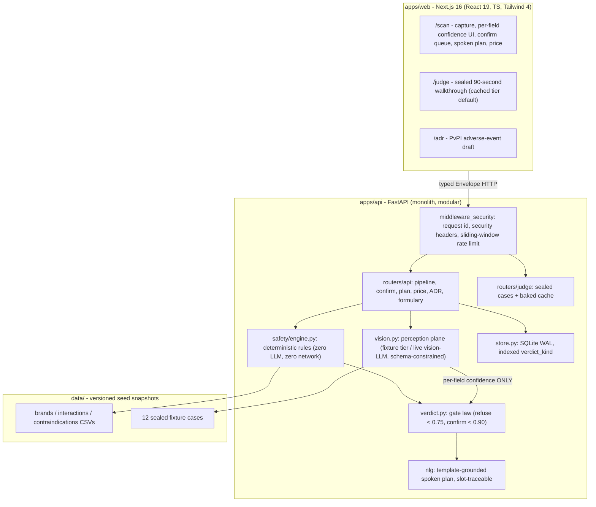

# MediSaathi — Architecture

Verification-first prescription intelligence. One architecture law governs
every module: **the model reads; the rules decide.**

## System overview



## The two-plane law

| Plane | Contains | May call | Must never do |
|---|---|---|---|
| **Perception** (`vision.py`) | vision LLM (live tier), fixture parser | one OpenAI-compatible endpoint, schema-constrained, temp 0, 1 retry | decide anything safety-related; invent a verdict |
| **Safety** (`safety/`, `verdict.py`) | normalization, interaction graph, contraindications, duplicate-ATC, dose caps, gate law | nothing — pure functions over in-memory CSV snapshots | call a model; touch the network |

The confidence number is the **only** thing that crosses between planes.

## Verdict state machine (`verdict.py`)

First match wins:

1. unusable image (`RefusalCandidate`) → `refused`
2. all fields < 0.75 → `refused`
3. any field < 0.75 → `confirm_queue`
4. no formulary match → `confirm_queue`
5. unresolved queued fields → `confirm_queue`
6. contraindication → `contraindication`
7. severe interaction → `interaction`
8. duplicate ATC / same-brand → `duplicate_atc`
9. moderate interaction → `interaction`
10. otherwise → `pass`

Property: the spoken plan and price are served **only** when the queue is empty
(`409` otherwise). Unverified fields can never reach rendered or spoken output —
enforced in the router and tested.

## Data flow (one run)

```
POST /api/v1/prescriptions?sample_id=RX-002&context=pregnancy
  → validate context against contracts vocabulary (unknown keys dropped)
  → create PrescriptionState (context persisted on the row)
  → extract fields (fixture tier: deterministic; live tier: vision-LLM JSON)
  → safety engine: normalize → interactions → contraindications → duplicates
    → aggregate dose caps → dose plausibility
  → verdict assembly (gate law above)
  → persist (SQLite, WAL) → Envelope{data, meta.verdict, meta.latency_ms}
```

## Persistence

Single-file SQLite with WAL; `verdict_kind` is materialized and **indexed**, so
`/metrics` aggregates in O(1) (`GROUP BY`) regardless of row count. Pre-v3
databases are migrated in place on first open (column added + backfilled from
stored JSON). The store API (`create/get/put/count/verdict_counts`) is the
documented swap point for Postgres — nothing else in the codebase knows SQL.

## Security architecture

- **Middleware pass** (`middleware_security.py`): every response carries an
  `x-request-id` (server-generated; client-supplied ids accepted only against
  `^[A-Za-z0-9_-]{8,64}$` — CRLF/unicode/oversize ids are replaced), security
  headers (`nosniff`, `DENY`, CSP for API, no-referrer), and a per-client
  sliding-window rate limit (writes 60/min, reads 300/min, env-overridable).
- **Upload hardening**: declared MIME allow-list **and** magic-byte sniffing
  (jpeg/png/webp/heic); a JSON payload wearing `image/jpeg` is rejected 422
  before any model call.
- **Prompt-injection containment**: perception output is inert text; injected
  instructions can only fail formulary matching (→ confirm queue) or be
  normalized to a REAL brand. They cannot reach verdict fields, fabricate
  verdicts, or bypass the gate. Tested in `test_redteam.py`.
- **Web (Next.js)**: CSP, frame-deny, permissions-policy (camera self only —
  the app's one legitimate device capability), typed API client.
- **No auth in the event build** (read-only demo scope, documented). OTP +
  consent artifacts are the first post-event item — see docs/DECISIONS.md.

## Engineering decisions (ADR index — full rationale in docs/DECISIONS.md)

| ADR | Decision | Alternatives rejected | Trade-off accepted |
|---|---|---|---|
| 001 | Contracts-first (Pydantic v2 package, mirrored TS client) | OpenAPI codegen (heavier toolchain for a 5-file client) | manual mirror risk, mitigated by envelope discipline |
| 002 | Modular monolith, 2 planes | microservices (unjustified at demo scale) | single process; store API isolates the future split |
| 003 | SQLite WAL + indexed verdict column | Postgres at event time (ops cost), in-memory dict (restart loss) | one-writer ceiling — fine for demo; swap point documented |
| 004 | Fixtures carry the demo; live vision key-gated | live-only demo (quota/WiFi risk) | extraction runs on sealed corpus in the walkthrough |
| 005 | Template-grounded NLG, slot-traceable | free LLM generation of spoken doses | narrower phrasing; every word auditable, tested |
| 006 | In-memory sliding-window limiter | Redis (no shared store at demo scale) | per-process only; interface is the Redis swap point |
| 007 | Refusal = HTTP 200 with refused verdict | 4xx (refusal is not an error) | clients must read meta.verdict (documented) |

## Failure modes (FMEA extract)

| Failure | Detection | Behavior | Mitigation |
|---|---|---|---|
| WiFi dead at demo | judge route | cached tier serves 200s | `make bake-judge` pre-bakes; drill rehearsed |
| Vision quota exhausted | live tier 503 | honest error, never fake data | fixtures carry the demo |
| Live model returns garbage | Pydantic schema validation | 1 retry → counted failure → 502 | `llm_schema_fail_total` increments (measured, not hardcoded) |
| DB restart mid-demo | SQLite WAL | state survives | store is one file, durable |
| Rate-limit abuse | middleware | 429 with retry-after envelope | env-tunable per deployment |
| Corrupt stored row | JSON parse guard | row skipped | metrics never crash |
