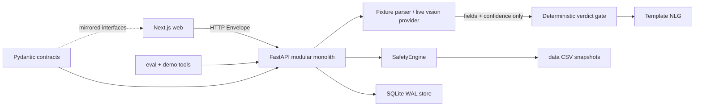

# MediSaathi Repository Audit

**Audit date:** 2026-09-10  
**Scope:** active checkout plus read-only inspection of `vaidya-project.zip`  
**Method:** source inspection, archive listing, git history/status, existing test/evaluation/build gates, and selected authoritative web research.

## Addendum (post-audit, same day): frontend integration

**Decision reversed:** the archive's Vaidya frontend was integrated into the
active build as `apps/web` — the product app (verify → schedule → adhere →
protect → explain → measure). Rationale and ADR: docs/ARCHITECTURE.md (ADR 008)
and docs/DECISIONS.md (B9 rows). The FastAPI tier remains as the
deep-verification companion. What changed:

- `apps/web` is now the self-contained Next.js 16 fullstack product (TS
  safety plane, Prisma/SQLite, 13 route handlers) — **not** the thin client
  described below.
- New: `prisma/` schema (9 longitudinal models), `lib/safety/*`, `lib/ai/*`,
  `scripts/selftest.ts` (18-case engine suite + copilot gates).
- New gates verified live (no model required): warfarin+aspirin →
  `interaction`; triple whammy → combination rule; child+doxy →
  `contraindication`; garbage → `confirm_queue`; clean → `pass`; 18/18
  selftest; 93 API tests; 12/12 eval cases.
- Regressions fixed during integration (each verified): degraded-tier
  confidence, double-dose guardrail (first-action-wins), guarded-skip
  persistence, plan-start context provenance, stop-medication refusal
  pattern. Evidence: docs/TESTING.md.

## Executive finding

The active checkout is a coherent verification-first product spanning two
tiers (self-contained Next.js product app + FastAPI verification service)
sharing one architecture law. The archive's `medisaathi-analysis/` nested
copy remains historical reference only; the archive root's frontend is now
the active `apps/web` runtime.

## Repository map

```text
.
├── apps/api/                 FastAPI service and tests
│   ├── app/vision.py         perception: fixture/live schema-constrained extraction
│   ├── app/safety/           deterministic safety rules; no model/network calls
│   ├── app/verdict.py        confidence gate and verdict assembly
│   ├── app/nlg/              template-grounded multilingual spoken plans
│   ├── app/routers/          v1 pipeline, formulary, plan, price, ADR, judge
│   ├── app/store.py          SQLite WAL persistence abstraction
│   └── tests/                unit, API, parser, safety, red-team regressions
├── apps/web/                 Next.js 16 fullstack product app (TS safety plane, Prisma/SQLite)
├── packages/contracts/       Pydantic v2 boundary models and vocabulary
├── data/                     synthetic-curated CSV snapshots and labels
├── eval/                     fixture metrics and A1/A4 ablation
├── tools/                    demo gate, cache baker, latency benchmark
├── docs/                     architecture, product, security, QA, research
└── vaidya-project.zip        source archive (frontend now integrated into apps/web)
```

## Architecture and dependency map



## Request flow

1. Client starts a sealed sample or submits a validated multipart image.
2. Upload boundary checks declared MIME, signature, and a 12 MiB streaming limit.
3. Perception extracts text fields with confidence; it never produces a safety verdict.
4. SafetyEngine normalizes known brands and evaluates interactions, contraindications, duplicate ATC classes, and dose notes.
5. `verdict.py` applies the refusal/confirmation thresholds and deterministic findings.
6. State is persisted in SQLite; plans and prices are blocked while confirmation is pending.
7. A spoken plan is generated only from verified slots and uses Web Speech API in the browser.

## Data model overview

The active runtime intentionally has one aggregate, `PrescriptionState`, containing:

- declared context codes;
- extraction fields and sources;
- normalized medications and safety findings;
- verdict and provenance;
- confirmation queue;
- optional spoken plan and price rows.

SQLite stores the serialized state plus materialized `verdict_kind`, timestamps, and indexes. This is appropriate for an event/demo scope and is isolated behind `store.py`; it is not yet a multi-tenant clinical record system.

## Security/authentication assessment

Implemented controls include allowlisted upload types, signature validation, bounded reads, request-ID sanitization, security headers, sliding-window rate limits, parameterized SQL, context vocabulary filtering, and deterministic prompt-injection containment. No authentication or authorization exists by design in this read-only demo build. That is a release blocker for real patient data or public clinical deployment and remains P1 debt.

## Deployment architecture

Docker Compose runs a Python API on port 8000 and a standalone Next.js web container on port 3000. SQLite is mounted on a named volume. The live vision key remains server-side. The event deployment is single-process/single-file; Postgres, shared rate limiting, secret management, TLS termination, backups, and monitoring are future production work.

## Verification evidence

Verified during this audit:

| Gate | Result |
|---|---|
| `make test` before hardening | 90 passed in 1.67s |
| `make eval` | 12 cases; A4 agreement 1.0; refusal precision 1.0 |
| `make demo-check` | PASS; six verdict kinds offline |
| `make audit && make ablation` | contracts/eval pass; A1 agreement 0.1667 vs A4 1.0 |
| web `npx tsc --noEmit` | PASS |
| web `npm run build` | PASS; Next.js 15.5.25; routes prerendered |
| `tools/bench.py --requests 100` | completed; values recorded in performance report |
| `make test` after upload hardening | 93 passed in 0.97s |

These are local verification results, not clinical validation, production SLOs, or model accuracy claims.

## Archive findings

The ZIP's active-looking root contains a Vaidya single-route Next.js/Prisma application with longitudinal Patient, Prescription, TherapyPlan, Medication, Dose, EscalationEvent, CaregiverLink, AuditLog, and Metric models. Its nested `medisaathi-analysis/` contains another FastAPI/Next.js/data copy. The longitudinal adherence idea is valuable as a roadmap direction, but merging it now would duplicate the active API and persistence model, expand scope, and invalidate the current test/documentation contract.

## Risk register

| ID | Risk | Impact | Likelihood | Current mitigation | Priority |
|---|---|---:|---:|---|---|
| R-1 | Unauthenticated state access on public deployment | High | High | demo-only scope, no PII guidance, rate limits | P1 |
| R-2 | Synthetic/curated data does not establish clinical accuracy | High | Certain | provenance and limitations are explicit | P1 |
| R-3 | Live vision provider failure or schema drift | Medium | Medium | key gate, schema validation, one retry, honest 502, fixtures | P1 |
| R-4 | In-memory limiter/counters diverge across workers | Medium | Certain at scale | single-process deployment and swap-point docs | P2 |
| R-5 | Web CSP still permits unsafe-inline | Medium | Medium | no untrusted HTML; nonce migration documented | P2 |
| R-6 | UI has no automated browser/a11y regression suite | Medium | Medium | TypeScript/build gates and manual demo checks | P2 |
| R-7 | Two safety-plane implementations (TS + Python) drift | Medium | Medium | independent test suites in CI for both tiers (ADR 008) | P2 |

## Highest-value backlog

- **P1:** authentication, ownership checks, consent/audit artifacts, and production-grade data retention before any real health information.
- **P1:** expand the labeled corpus with licensed/versioned sources and evaluate live extraction separately from fixture parsing.
- **P2:** Playwright critical-path tests and axe-core CI checks.
- **P2:** strict nonce CSP only if the performance/cache trade-off is accepted.
- **P3:** FHIR mappings, shared Postgres/Redis infrastructure, and versioned licensed dataset snapshots (the longitudinal model is now live in `apps/web`).
